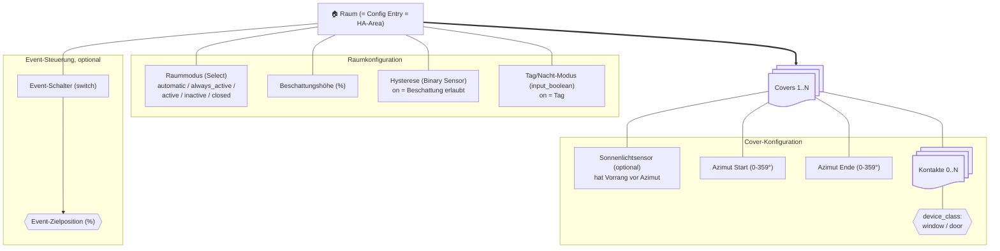

# Anforderungen – Cover Control Advanced

**Version:** 1.0 · **Stand:** 2026-08-05 · **Bezugsstand Code:** Config-Entry-Version 7, Manifest 1.0.0

---

## §0 Nutzungshinweis

Dieses Dokument ist das fachliche Lastenheft der Integration. Es beschreibt, **was** die Integration leisten soll — nicht, wie der Code aufgebaut ist. Für Code-Konventionen gilt `.github/copilot-instructions.md`.

**Bearbeitung:** Dieses Dokument gehört dem Projektverantwortlichen. Anforderungen dürfen jederzeit geändert, ergänzt oder gestrichen werden. Bei Widerspruch zwischen Dokument und Code gilt: Das Dokument beschreibt den Soll-Zustand, der Code ist anzupassen — **außer** die Anforderung trägt `[STATUS: dokumentiert]`, dann beschreibt sie den Ist-Zustand und ist ggf. selbst zu korrigieren.

**ID-Schema:**

| Präfix | Bedeutung |
|---|---|
| `FA-xx` | Funktionale Anforderung |
| `NFA-xx` | Nicht-funktionale Anforderung |
| `OP-xx` | Offener Punkt – noch zu entscheiden |

**Statuswerte:**

| Status | Bedeutung |
|---|---|
| `umgesetzt` | Im Code vorhanden und geprüft |
| `dokumentiert` | Beschreibt bestehendes Verhalten, fachlich noch nicht bestätigt |
| `offen` | Gefordert, aber nicht implementiert |
| `zu klären` | Fachliche Entscheidung steht aus |

**Referenzierung:** Anforderungen können direkt adressiert werden, z. B. „setze FA-07 um" oder „FA-22 Regel 5 soll vor Regel 3 greifen".

---

## §1 Systemkontext und Begriffe

### Begriffe

| Begriff | Bedeutung |
|---|---|
| **Raum** | Ein Config Entry der Integration. Entspricht genau einer Home-Assistant-Area. |
| **Cover** | Eine Rollladen-/Jalousie-Entität (`cover.*`), die von einem Raum gesteuert wird. Ein Raum steuert 1..N Covers. |
| **Kontakt** | Ein Fenster- oder Türkontakt (`binary_sensor` mit `device_class` `window` oder `door`), einem Cover zugeordnet. Ein Cover hat 0..N Kontakte. |
| **Beschattungshöhe** | Zielposition in Prozent, auf die ein Cover bei aktiver Beschattung gefahren wird. Raumweit einheitlich. |
| **Hysterese** | Raumweiter Binärsensor als Beschattungsfreigabe. `on` = Beschattung erlaubt, `off` = Beschattung gesperrt. |
| **Raummodus** | Betriebsart des Raums, vom Nutzer über eine Select-Entität gewählt. |
| **Auswertung** | Ein Durchlauf der Entscheidungslogik über alle Covers eines Raums. |

### Struktur



### Systemgrenzen

Die Integration erzeugt **keine** eigenen Cover-, Binary-Sensor- oder Switch-Entitäten als Spiegelbilder bestehender Geräte. Sie konsumiert vorhandene Entitäten über deren `entity_id` und steuert Covers ausschließlich über die Home-Assistant-Dienste `cover.set_cover_position`, `cover.open_cover` und `cover.close_cover`.

---

## §2 Konfigurationsvertrag

Die Konfiguration erfolgt ausschließlich über die Home-Assistant-Oberfläche (Config Flow und Options Flow). Eine YAML-Konfiguration existiert nicht und ist nicht vorgesehen.

### §2.0 Überblick

| ID | Ebene | Schlüssel (`const.py`) | Pflicht | Auswahl / Bereich | Standard |
|---|---|---|---|---|---|
| FA-01 | Raum | `room_name` | ✅ | Area-Selector, gespeichert wird der **Name** | – |
| FA-02 | Raum | `shading_hysteresis` | ✅ | `binary_sensor`, `device_class=light` | – |
| FA-03 | Raum | `day_night_mode` | ✅ | `input_boolean` | – |
| FA-04 | Raum | `shading_height` | ✅ | 0–100 %, Slider | 20 |
| FA-05 | Raum | `event_switch` | – | `switch` | – |
| FA-06 | Raum | `event_switch_position` | – | 0–100 %, Slider | 0 |
| FA-07 | Cover | `cover_entity` | ✅ | `cover`, auf Area vorgefiltert | – |
| FA-08 | Cover | `window_entities` | – | `binary_sensor`, `device_class=window\|door`, mehrfach | `[]` |
| FA-09 | Cover | `sun_azimuth_sensor` | – | `binary_sensor`, `device_class=light` | – |
| FA-10 | Cover | `sun_azimuth_start` | – | 0–359° | – |
| FA-11 | Cover | `sun_azimuth_end` | – | 0–359° | – |

Die Covers eines Raums liegen als Liste unter dem Schlüssel `covers` im Config Entry.

### §2.1 Raumebene

**FA-01 — Raumname** `[STATUS: umgesetzt]`
Pflichtfeld. Bei der Ersteinrichtung wird der Raum über einen Area-Selector gewählt; gespeichert wird der **Name** der Area, nicht deren ID. Der Config Entry erhält die `unique_id` `covercontroladvanced_{area_id}`, wodurch eine Area nur einmal konfiguriert werden kann. Im Options Flow ist der Raumname ein freies Textfeld.
*Kriterium:* Zweite Einrichtung derselben Area bricht mit `already_configured` ab.

**FA-02 — Hysteresesensor** `[STATUS: umgesetzt]`
Pflichtfeld. Auswahl auf `binary_sensor` mit `device_class=light` beschränkt. `on` = Beschattung freigegeben.

**FA-03 — Tag/Nacht-Modus** `[STATUS: umgesetzt]`
Pflichtfeld. Auswahl auf `input_boolean` beschränkt. `on` = Tag, `off` = Nacht.

**FA-04 — Beschattungshöhe** `[STATUS: umgesetzt]`
Pflichtfeld, Slider 0–100 %, Standardwert 20. Gilt für alle Covers des Raums gemeinsam. Nicht interpretierbare Werte fallen auf 20 zurück.

**FA-05 — Event-Schalter** `[STATUS: umgesetzt]`
Optional. Auswahl auf `switch` beschränkt. Wird das Feld im Options Flow geleert, muss der Schlüssel vollständig aus der Konfiguration entfernt werden (leerer String zählt als „geleert").

**FA-06 — Event-Zielposition** `[STATUS: umgesetzt]`
Optional, Slider 0–100 %, Standardwert 0. Zielposition, solange der Event-Schalter aktiv ist. Nicht interpretierbare Werte fallen auf 0 zurück.

### §2.2 Coverebene

**FA-07 — Cover-Entität** `[STATUS: umgesetzt]`
Pflichtfeld, `cover.*`. Dieselbe Cover-Entität darf innerhalb eines Raums nur einmal konfiguriert werden; ein Duplikat wird mit dem Fehler `cover_already_added` abgewiesen — sowohl beim Hinzufügen als auch beim Bearbeiten.

**FA-08 — Fenster-/Türkontakte** `[STATUS: umgesetzt]`
Optional, Mehrfachauswahl. Beschränkt auf `binary_sensor` mit `device_class` `window` oder `door`. `on` = offen.

**FA-09 — Sonnenlichtsensor** `[STATUS: umgesetzt]`
Optional. Beschränkt auf `binary_sensor` mit `device_class=light`. Ist er gesetzt, ersetzt er die Azimutauswertung vollständig (siehe FA-23).

**FA-10 — Azimut Start** `[STATUS: umgesetzt]`
Optional, 0–359°, Eingabefeld. Kein Standardwert.

**FA-11 — Azimut Ende** `[STATUS: umgesetzt]`
Optional, 0–359°, Eingabefeld. Kein Standardwert. Bei `Start > Ende` läuft der Bereich über 0° hinweg (Beispiel: 330–30).

**FA-12 — Leere Optionalfelder** `[STATUS: umgesetzt]`
Sonnenlichtsensor, Azimut Start und Azimut Ende werden aus der gespeicherten Konfiguration entfernt, wenn sie im Formular leer bleiben. Es werden keine impliziten Standardwerte geschrieben.

### §2.3 Bedienkomfort im Config Flow

**FA-13 — Vorfilterung auf die Area** `[STATUS: umgesetzt]`
Cover- und Kontaktauswahl werden auf Entitäten der gewählten Area vorgefiltert. Die effektive Area einer Entität ergibt sich aus der Entitätszuordnung; fehlt diese, aus der Zuordnung ihres Geräts. Deaktivierte Entitäten bleiben unberücksichtigt.
*Fallback:* Enthält die Area keine passende Entität, wird die ungefilterte Auswahl angeboten.

**FA-14 — Automatische Vorauswahl** `[STATUS: umgesetzt]`
Enthält die Area genau ein Cover bzw. genau einen Kontakt, wird dieses Element vorausgewählt.

**FA-15 — Sichtbarkeit bestehender Zuordnungen** `[STATUS: umgesetzt]`
Beim Bearbeiten eines Covers bleiben bereits konfigurierte Entitäten in der Auswahlliste sichtbar, auch wenn sie inzwischen außerhalb der Area liegen.

**FA-16 — Options Flow** `[STATUS: umgesetzt]`
Über den Konfigurationsdialog stehen zur Verfügung: Raumeigenschaften bearbeiten, Rolllade hinzufügen, vorhandene Rolllade bearbeiten (nur wenn mindestens eine existiert), Änderungen speichern. Änderungen werden erst beim Abschluss geschrieben und lösen dann einen Reload des Config Entry aus. Ohne Änderung erfolgt kein Reload.

---

## §3 Raummodi

**FA-17 — Modusliste** `[STATUS: umgesetzt]`
Der Raummodus wird über eine Select-Entität gesetzt und kennt genau fünf Werte:

| Wert | Anzeige (DE) | Wirkung |
|---|---|---|
| `automatic` | Beschattung automatisch | Beschattung, wenn Hysterese **und** Sonne am Fenster |
| `always_active` | Beschattung immer aktiv | Beschattung, sobald Sonne am Fenster — Hysterese wird ignoriert |
| `active` | Beschattung aktiv | Beschattung unabhängig von Hysterese und Sonnenstand |
| `inactive` | Beschattung inaktiv | Covers werden geöffnet, Beschattungslogik ausgesetzt |
| `closed` | Zu | Covers werden geschlossen |

**FA-18 — Standardwert und Persistenz** `[STATUS: umgesetzt]`
Der Standardwert ist `automatic`. Der zuletzt gewählte Modus wird über einen Neustart hinweg wiederhergestellt; ist der wiederhergestellte Wert kein gültiger Modus, gilt wieder `automatic`.

**FA-19 — Sofortige Wirkung** `[STATUS: umgesetzt]`
Jede Änderung des Raummodus löst unmittelbar eine Auswertung aus.

---

## §4 Auswertungs-Trigger

**FA-20 — Ereignisgesteuerte Auswertung** `[STATUS: umgesetzt]`
Eine Auswertung wird ausgelöst, sobald sich der Zustand einer beobachteten Entität ändert. Beobachtet werden:

- `sun.sun`
- `sensor.sun_solar_azimuth` *(siehe OP-08)*
- der Hysteresesensor
- der Tag/Nacht-Schalter
- der Event-Schalter, falls konfiguriert
- alle Kontakte aller Covers des Raums
- alle konfigurierten Sonnenlichtsensoren

**FA-21 — Zyklische Auswertung** `[STATUS: umgesetzt]`
Zusätzlich wird jede Minute ausgewertet, damit die Sonnenstandsänderung auch ohne Zustandsereignis wirksam wird.

**FA-22 — Auswertung bei Setup** `[STATUS: umgesetzt]`
Nach dem Einrichten des Config Entry und nach dem Hinzufügen der Select-Entität wird einmalig ausgewertet.

**FA-23 — Ausschaltverzögerung der Hysterese** `[STATUS: umgesetzt]`
Wechselt der Hysteresesensor von `on` auf `off`, wird die Auswertung um **240 Sekunden (4 Minuten)** verzögert. Ein erneuter Wechsel auf `off` innerhalb dieser Zeit setzt den Timer neu. Ein Wechsel zurück auf `on` bricht den Timer ab und wertet sofort aus. Ziel ist das Vermeiden von Pendelbewegungen bei wechselnder Bewölkung.
*Hinweis:* Die Verzögerung wirkt nur auf Zustandsänderungen der Hysterese. Die zyklische Auswertung nach FA-21 läuft weiter und kann eine noch verzögerte Beschattungsaufhebung vorzeitig wirksam werden lassen. Siehe OP-10.

---

## §5 Entscheidungslogik

**FA-24 — Entscheidungskaskade** `[STATUS: umgesetzt]` · **normativ**

Die Kaskade wird pro Cover in exakt dieser Reihenfolge geprüft. Die erste zutreffende Regel bestimmt die Aktion; alle folgenden Regeln werden übersprungen. Jede Regel setzt einen Grund, der im Statussensor angezeigt wird.

| # | Bedingung | Aktion | Grund |
|---|---|---|---|
| 1 | Nacht **und** mindestens ein Kontakt hat `device_class=window` **und** mindestens ein Kontakt offen | Beschattungshöhe | `night_window_shading` |
| 2 | **kein** Kontakt mit `device_class=window` **und** mindestens ein Kontakt offen | öffnen | `door_open` |
| 3 | Raummodus `closed` | schließen | `room_closed` |
| 4 | Raummodus `inactive` | öffnen | `room_inactive` |
| 5 | Event-Schalter `on` | Event-Zielposition | `event_shading` |
| 6 | kein Kontakt offen **und** Nacht | schließen | `night_closed` |
| 7 | Tag **und** (Fensterkontakt vorhanden **oder** kein Kontakt offen) **und** Beschattung aktiv | Beschattungshöhe | `day_shading` |
| 8 | Tag | öffnen | `default_day` |
| 8 | Nacht | schließen | `default_night` |

wobei

```
Beschattung aktiv := (Raummodus = automatic     ∧ Hysterese ∧ Sonne_am_Fenster)
                   ∨ (Raummodus = always_active ∧             Sonne_am_Fenster)
                   ∨ (Raummodus = active)
```

**Ausdrücklich festgehalten:**

1. Der Event-Schalter (Regel 5) greift **nach** den Kontakten und Raummodi. Bei offener Tür, Raummodus `closed` oder `inactive` bleibt er wirkungslos.
2. Der Event-Schalter greift bei Tag **und** bei Nacht.
3. Regel 1 unterscheidet, **ob** ein Fensterkontakt konfiguriert ist — nicht, welcher Kontakt offen ist. Ein Cover mit einem Fenster- und einem Türkontakt fährt nachts auf Beschattungshöhe, auch wenn nur die Tür offen ist.
4. Regel 2 greift nur bei Covers, deren Kontakte **ausschließlich** `device_class=door` haben. Siehe OP-11.

**FA-25 — Gründe im Statussensor** `[STATUS: umgesetzt]`
Der Statussensor eines Covers gibt den Grund der zuletzt getroffenen Entscheidung als Zustand aus. Zulässig sind genau zehn Werte: `initializing` (vor der ersten Auswertung) sowie die neun Gründe aus FA-24. Jede Änderung der Kaskade muss diese Liste, die `_attr_options` des Sensors und **beide** Übersetzungsdateien konsistent halten.

---

## §6 Sonnenstandsermittlung

**FA-26 — Vorrang des Sonnenlichtsensors** `[STATUS: umgesetzt]`
Ist für ein Cover ein Sonnenlichtsensor konfiguriert, gilt dessen Zustand direkt als „Sonne am Fenster" (`on` = Sonne). Der Azimutbereich wird dann **nicht** ausgewertet, auch wenn er konfiguriert ist.

**FA-27 — Azimutbereich** `[STATUS: umgesetzt]`
Ohne Sonnenlichtsensor wird das Attribut `azimuth` der Entität `sun.sun` gegen den konfigurierten Bereich geprüft. Alle Winkel werden modulo 360 normalisiert. Bei `Start ≤ Ende` gilt der Bereich einschließlich beider Grenzen; bei `Start > Ende` läuft er über 0° hinweg.

**FA-28 — Verhalten ohne Konfiguration** `[STATUS: umgesetzt]`
Fehlt sowohl der Sonnenlichtsensor als auch eine der beiden Azimutgrenzen, gilt „Sonne am Fenster" als **nicht erfüllt**. Dasselbe gilt, wenn `sun.sun` nicht verfügbar ist oder Werte nicht als Zahl interpretierbar sind. Eine Beschattung nach Regel 7 findet für dieses Cover in den Modi `automatic` und `always_active` dann nie statt — im Modus `active` weiterhin schon.

---

## §7 Ansteuerung der Covers

**FA-29 — Positionierung** `[STATUS: umgesetzt]`
Zielpositionen werden über `cover.set_cover_position` gesetzt, sofern das Cover die Fähigkeit `SET_POSITION` in seinem Attribut `supported_features` meldet.

**FA-30 — Fallback ohne Positionsunterstützung** `[STATUS: umgesetzt]`
Meldet ein Cover keine Positionsunterstützung, wird eine Zielposition unter 50 % als `cover.close_cover` und ab 50 % als `cover.open_cover` ausgeführt. Der Fallback wird auf Debug-Level protokolliert.

**FA-31 — Nicht-blockierende Aufrufe** `[STATUS: umgesetzt]`
Alle Dienstaufrufe erfolgen nicht-blockierend. Die Integration wartet nicht auf die Ausführung und wertet kein Ergebnis aus.

**FA-32 — Protokollierung** `[STATUS: umgesetzt]`
Jeder Steuerbefehl wird auf Debug-Level mit Entität, Zielaktion und Entscheidungsgrund protokolliert.

---

## §8 Erzeugte Entitäten

**FA-33 — Gerät** `[STATUS: umgesetzt]`
Pro Config Entry wird genau ein Gerät angelegt. Enthält der Raum genau ein Cover, trägt das Gerät dessen Anzeigenamen; bei mehreren Covers den Raumnamen. Die vorgeschlagene Area ist immer der Raumname. Hersteller: `Cover Control Advanced`.

**FA-34 — Entitäten auf Raumebene** `[STATUS: umgesetzt]`

| Entität | Typ | Kategorie | Beschreibung |
|---|---|---|---|
| Raummodus | `select` | – | Fünf Modi nach FA-17 |
| Beschattungshöhe | `sensor` (%) | Diagnose | Spiegelt die konfigurierte Höhe |
| Event-Zielposition | `sensor` (%) | Diagnose | Nur wenn ein Event-Schalter konfiguriert ist |

**FA-35 — Entitäten pro Cover** `[STATUS: umgesetzt]`

| Entität | Typ | Kategorie | Beschreibung |
|---|---|---|---|
| Status | `sensor` (ENUM) | – | Entscheidungsgrund nach FA-25 |
| Sonnen-Azimut Start | `sensor` (°) | Diagnose | Konfigurierter Startwinkel |
| Sonnen-Azimut Ende | `sensor` (°) | Diagnose | Konfigurierter Endwinkel |
| Rollladenposition | `sensor` (%) | Diagnose | Live-Position des Covers; Attribut `state` enthält dessen Zustand |
| Sonnenlichtsensor | `sensor` | Diagnose | Nur wenn konfiguriert; gibt die `entity_id` des Sensors aus |

**FA-36 — Entitäten pro Kontakt** `[STATUS: umgesetzt]`
Für jeden konfigurierten Kontakt entsteht ein Diagnose-Sensor mit den Zuständen `open` / `closed` und einem Symbol passend zu seiner `device_class`.

**FA-37 — Benennung bei mehreren Covers** `[STATUS: umgesetzt]`
Enthält ein Raum mehrere Covers, werden die Cover-Entitäten mit dem Anzeigenamen des jeweiligen Covers präfixiert, damit sie unterscheidbar bleiben. Siehe OP-07.

---

## §9 Migration und Kompatibilität

**NFA-01 — Stabile `unique_id`s** `[STATUS: umgesetzt]`
Bestehende Entitäts-IDs dürfen durch Änderungen nicht brechen. Statussensor und Raummodus-Select verwenden bewusst ein Alt-Schema auf Basis des Raumnamens (`{Raumname}_{cover}_status`, `{Raumname}_room_mode`); alle später hinzugekommenen Entitäten nutzen die `entry_id`. Dieses Nebeneinander bleibt bestehen.

**NFA-02 — Migrationspfade** `[STATUS: umgesetzt]`
Die aktuelle Config-Entry-Version ist 7. Bestehende Einträge werden automatisch migriert:

| nach Version | Migration |
|---|---|
| 4 | Himmelsrichtung bzw. Fensterazimut plus Toleranz → Azimutbereich Start/Ende; Altschlüssel entfernt |
| 5 | Schlüssel `room_switch` entfernt — der Raummodus ist seither eine interne Select-Entität |
| 6 | Flache Konfiguration → Raumebene plus Liste `covers`; fehlender Raumname wird aus der Cover-Entität abgeleitet |
| 7 | Als Raumname gespeicherte Area-ID → Area-Name |

**NFA-03 — Rückwärtskompatibilität** `[STATUS: umgesetzt]`
Ein Config Entry ab Version 7 wird unverändert übernommen. Neue Konfigurationsschlüssel müssen so eingeführt werden, dass bestehende Einträge ohne diesen Schlüssel weiterhin funktionieren.

---

## §10 Nicht-funktionale Anforderungen

**NFA-04 — UI-Konfiguration** `[STATUS: umgesetzt]`
Die Integration wird ausschließlich über Config Entries eingerichtet. Es gibt keine YAML-Konfiguration.

**NFA-05 — Asynchronität** `[STATUS: umgesetzt]`
Durchgehend asynchron. Kein blockierendes I/O, keine synchronen Wartezeiten, keine lang laufende Arbeit in Controller- oder Entity-Code.

**NFA-06 — Lokaler Betrieb** `[STATUS: umgesetzt]`
Kein Netzwerkzugriff, keine externen Abhängigkeiten (`requirements` ist leer). Klassifizierung: `local_push`.

**NFA-07 — Typisierung und Struktur** `[STATUS: umgesetzt]`
Vollständig typisiertes Python. Die bewusst flache Modulstruktur (`__init__`, `config_flow`, `const`, `controller`, `select`, `sensor`) bleibt erhalten; zusätzliche Abstraktionsschichten nur bei klarem Nutzen.

**NFA-08 — Konsistenz der Konfigurationsschlüssel** `[STATUS: umgesetzt]`
Jede Änderung an einem Schlüssel in `const.py` ist konsistent in Config Flow, Laufzeitlogik, Migration und **beiden** Übersetzungsdateien (`de.json`, `en.json`) nachzuziehen.

**NFA-09 — Kanonische Benennung** `[STATUS: umgesetzt]`
Technische Kennung: `covercontroladvanced` (Ordner, Manifest-Domain, `DOMAIN`-Konstante). Produktname: `Cover Control Advanced`. Die Repository-Schreibweise `CoverControlAdvanced` gilt nur für GitHub-URLs.

**NFA-10 — Qualitätssicherung** `[STATUS: umgesetzt]`
Vor jedem Merge müssen grün sein: `ruff check custom_components/`, HACS-Validation (Kategorie `integration`) und Hassfest. Siehe auch OP-06.

---

## §11 Offene Punkte

Diese Punkte sind fachlich noch nicht entschieden. Die Spalte **Entscheidung** ist zum Ausfüllen gedacht.

| ID | Punkt | Fundstelle | Entscheidung |
|---|---|---|---|
| **OP-01** | **Cover-Steuerung per Tastendruck-Event.** In den Projektrichtlinien als Anforderung notiert („Cover should trigger via button press events"), aber nirgends implementiert. Offen: Welche Ereignisquelle (Zigbee-`event`-Entität, `device`-Trigger, `event`-Bus)? Welche Aktion pro Tastendruck? Soll ein Tastendruck die Automatik zeitweise übersteuern — und wenn ja, wie lange? | `.github/copilot-instructions.md`, Abschnitt „Technical Specification" | |
| **OP-02** | **Sonnenrichtungssensor.** Offenes Issue #30 mit zugehörigem Draft-PR #31 („Update start and end azimuth for Sonnenrichtungssensor"). Fachlicher Umfang noch offen. | Issue #30, PR #31 | |
| **OP-03** | **Veraltete Entscheidungsliste in der README.** Die README nennt neun Regeln mit „Sleep mode" und „Cinema event"; im Code existieren beide nicht. Frage: Waren diese Funktionen gewollt und wurden entfernt, oder waren sie nie umgesetzt? Sollen sie zurückkommen? | `README.md`, Abschnitt „Decision Logic" | |
| **OP-04** | **Widersprüchliche Modusliste.** README und Projektrichtlinien nennen vier Modi (`Shading / Forced / Inactive / Closed`), der Code fünf. Vermutliche Zuordnung: `Shading` → `automatic`, `Forced` → `always_active` oder `active`. Der jeweils andere Wert ist in der Dokumentation nie beschrieben worden. | `README.md`, `const.py` | |
| **OP-05** | **Tote Dokumentationsverweise.** Die README verweist auf vier Dateien unter `docs/`, die nie existiert haben. Streichen oder tatsächlich anlegen? | `README.md`, Abschnitt „HACS Default Store Readiness" | |
| **OP-06** | **Keine Tests.** Das Repository enthält keinen einzigen Test. Die CI prüft nur Lint, HACS-Validation und Hassfest. Für die Entscheidungskaskade aus FA-24 wäre eine Testmatrix mit `pytest-homeassistant-custom-component` naheliegend. | `.github/workflows/validate.yml` | |
| **OP-07** | **Übersetzungen werden umgangen.** Bei mehreren Covers pro Raum werden deutsche Entitätsnamen fest im Code gesetzt („Sonnenlichtsensor", „Azimut Start", „Azimut Ende", „Position") und überschreiben damit die Übersetzungsschlüssel. In englischer Oberfläche erscheinen deutsche Namen. Widerspricht NFA-08. | `sensor.py` | |
| **OP-08** | **Ungenutzte Beobachtung.** `sensor.sun_solar_azimuth` wird beobachtet, aber nie ausgewertet — jede Zustandsänderung löst eine wirkungslose Auswertung aus. Entfernen oder tatsächlich als Azimutquelle nutzen? | `controller.py`, `_watched_entities` | |
| **OP-09** | **Keine Soll/Ist-Prüfung, keine manuelle Übersteuerung.** Jede Auswertung sendet unbedingt einen Steuerbefehl, auch wenn das Cover bereits in der Zielposition steht — bei zyklischer Auswertung also mindestens einmal pro Minute. Eine manuelle Positionsänderung durch Bewohner wird spätestens nach einer Minute überschrieben. Zu klären: Befehl nur bei Abweichung senden? Manuelle Übersteuerung erkennen und für eine definierte Zeit respektieren? | `controller.py`, `_evaluate_cover` | |
| **OP-10** | **Ausschaltverzögerung wird zyklisch unterlaufen.** Die 4-Minuten-Verzögerung nach FA-23 verzögert nur die *ereignisgesteuerte* Auswertung. Die minütliche Auswertung liest den Hysteresezustand direkt und hebt die Beschattung ggf. sofort auf. Soll die Verzögerung als Sperre über alle Auswertungswege gelten? | `controller.py` | |
| **OP-11** | **Covers mit ausschließlich Türkontakten.** Ein solches Cover wird bei offener Tür immer geöffnet — auch nachts, auch im Raummodus `closed` (Regel 2 vor Regel 3). Als Einklemmschutz plausibel, aber nirgends bewusst entschieden. | `controller.py`, Regel 2 | |
| **OP-12** | **Azimutsensoren ohne Konfiguration.** Sind Azimut Start/Ende nicht konfiguriert, melden die Diagnosesensoren `0°` statt „unbekannt" — nicht unterscheidbar von einem echten Nordwert. | `sensor.py` | |

### Bewusst nicht enthalten

Die folgenden Funktionen sind **nicht** Bestandteil dieser Anforderung und wurden nicht implementiert. Sie sind hier nur festgehalten, um klarzustellen, dass ihr Fehlen kein Versehen ist: Windschutz, Frostschutz, Anwesenheitserkennung, Zeitpläne und Wochentagslogik, Temperatur- oder Wetterdatenauswertung, Lamellenwinkelsteuerung (Tilt), Urlaubs-/Anwesenheitssimulation.

---

## Änderungshistorie

| Version | Datum | Änderung |
|---|---|---|
| 1.0 | 2026-08-05 | Erstfassung: Ist-Stand vollständig erfasst, offene Punkte OP-01 bis OP-12 aufgenommen |
